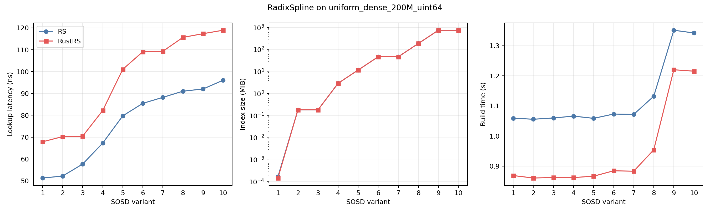
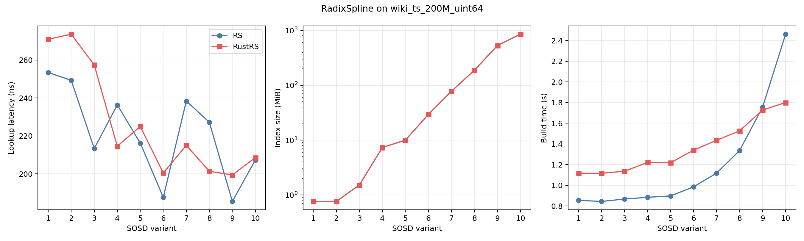

# radix_spline

Implementation of RadixSpline ([paper](https://dl.acm.org/doi/10.1145/3401071.3401659)) 
in Rust. 

This is currently, a work-in-progress for my own fun/learnings.

A C API is provided via the radix_spline_c subproject.

## Performance

Initial checks on performance show it as as similar to the C++ implementation 
on the _Search On Sorted Data_ (SOSD) benchmark. Checking on the synthetic
200M entry dataset the results are:

The Rust implementation needs to go via a shared object and the C bindings have
to construct the object and box it added a layer of indirection. In comparison the
original implementation can benefit from inlining and lesser indirection from the
harness code. Because of this I'm not overly concerned with the gap in lookup latency.

Likewise with the construction, the Rust one ends up having to copy the data and extract
the keys with the current implementation resulting in a 1.6GB memcpy which C++ doesn't have
to do in the benchmark. This likely explains the slower construction as well.

Contrastingly, I'm happy the index size is a consistent 8 bytes smaller (likely due to
padding).

Running on the 200M wikipedia dataset we can see the lookup latency isn't as clear:

As I continue working on this I'll be looking into more of what causes changes in
performance. I may need to create a comparative harness in Rust for running the Rust
benchmark or add some benchmark-useful C API methods.

## References

As well as the paper _RadixSpline: a single-pass learned index_, the
[reference C++ implementation](https://github.com/learnedsystems/RadixSpline)
was consulted. This project as a result is also licensed under the MIT license
although the code will likely diverge to be more Rusty.
